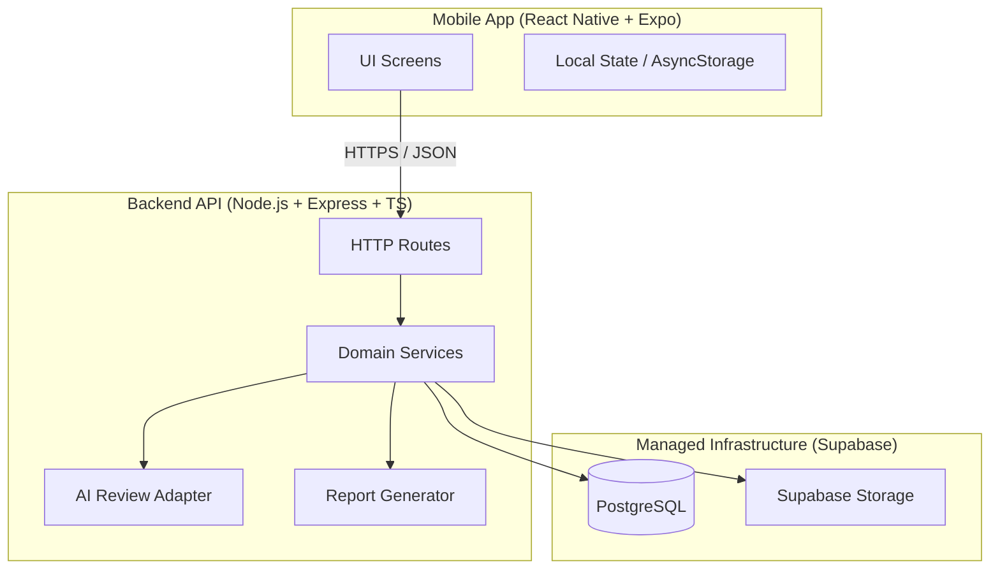
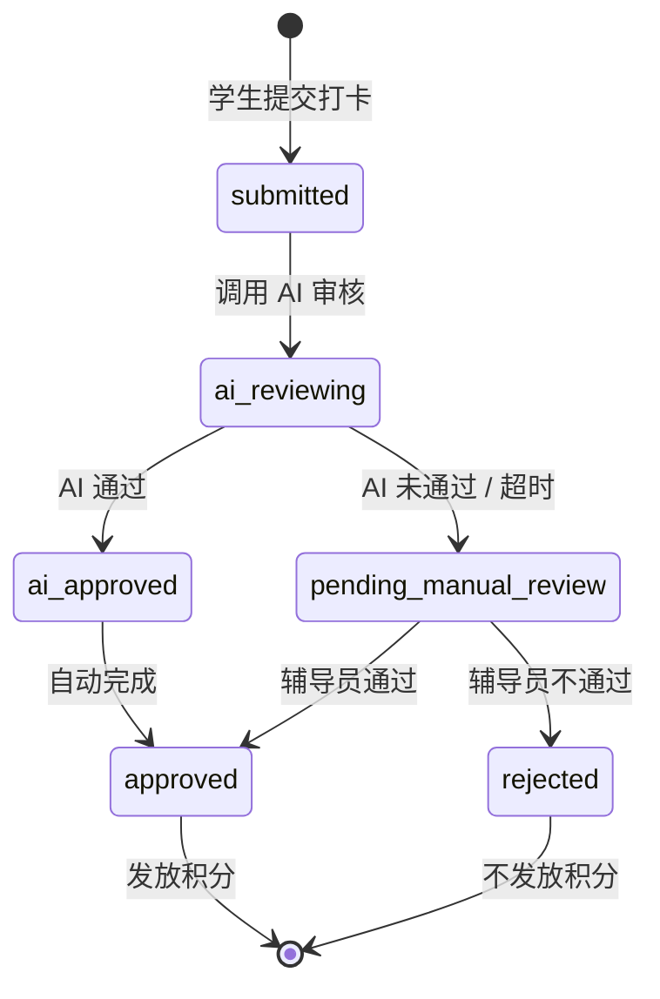
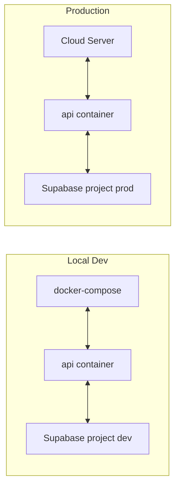

# Architecture Spine — 思政打卡 App

## Design Paradigm

**分层 API-客户端架构（Layered API-Client）。**

- 移动端（React Native + Expo）只通过 HTTPS 调用后端 REST API，不直接访问数据库或 Supabase 服务端功能。
- 后端 API（Node.js + Express + TypeScript）承载业务逻辑、权限控制、AI 审核编排、报表生成。
- Supabase 作为托管基础设施：PostgreSQL 数据库、Storage 文件存储、Auth 仅作为用户/密码哈希的备用（JWT 为应用层认证）。



## Invariants & Rules

### AD-1 — Mobile client is a thin client

- **Binds:** Mobile app, all API consumers
- **Prevents:** Business logic leaking into the app, inconsistent validation across platforms
- **Rule:** The React Native app performs no business-rule decisions beyond client-side UX validation (e.g., required fields, max length). All state mutations run through the backend API.

### AD-2 — Supabase hosts persistence and files

- **Binds:** Database schema, file storage, deployment
- **Prevents:** Splitting data between self-hosted and managed services, backup drift
- **Rule:** PostgreSQL database and all file storage (avatars, exported reports) live in Supabase. The API connects to Supabase via official client libraries; no direct mobile access to Supabase is allowed.

### AD-3 — LLM provider is abstracted and swappable [ADOPTED]

- **Binds:** AI review service
- **Prevents:** Vendor lock-in to DeepSeek or any single provider
- **Rule:** All LLM calls go through an `LLMProvider` interface/adapter. V1 ships with a DeepSeek adapter, but no other module may import DeepSeek-specific SDK types. Switching providers requires changing only the adapter and config.

### AD-4 — Authentication uses JWT issued by the API

- **Binds:** Auth flow, route protection, mobile storage
- **Prevents:** Session state on server, scaling bottlenecks, ambiguous ownership
- **Rule:** The API issues signed JWTs on login. The mobile app stores the token in secure storage and sends it in the `Authorization: Bearer <token>` header. Tokens carry `userId`, `role`, and `exp` only; claims are authoritative and immutable by the client.

### AD-5 — Role-based access control is enforced at the API layer

- **Binds:** All routes, services, queries
- **Prevents:** Students accessing counselor data, counselors crossing class boundaries
- **Rule:** Every request is validated against the user's role and scoped data ownership (`student` sees own data, `counselor` sees assigned classes, `admin` sees all). Scoping is applied in the service/repository layer, not just route guards.

### AD-6 — AI review is synchronous-with-timeout

- **Binds:** Check-in flow, LLM adapter
- **Prevents:** Indefinite blocking, orphaned check-ins, user confusion
- **Rule:** Reflections are submitted to the LLM adapter synchronously with a 3-second timeout. If the adapter fails or times out, the system marks the reflection for manual counselor review and still records the check-in as "pending review" rather than failing the request.

### AD-7 — Reports are generated server-side and stored in Supabase Storage

- **Binds:** Report export feature, file lifecycle
- **Prevents:** Mobile generating large PDFs/Excel, inconsistent templates, stale data
- **Rule:** PDF and Excel reports are generated in the API using templates/libraries, uploaded to a private Supabase Storage bucket, and a time-limited signed URL is returned to the client. Exported files expire after 24 hours.

### AD-8 — Single-tenant, single-school deployment

- **Binds:** Data model, deployment topology
- **Prevents:** Multi-tenant schema complexity, cross-school data leaks
- **Rule:** V1 runs as a single tenant. All data assumes one school organization. Multi-school support is deferred to V2.

### AD-9 — Docker is the deployment unit

- **Binds:** CI/CD, server deployment, local development
- **Prevents:** "Works on my machine", inconsistent runtime environments
- **Rule:** The backend API and any background workers run in Docker containers. Local development uses `docker-compose` with a Supabase project. Production deploys the same image to a cloud server with environment-specific config.

### AD-10 — Domain boundaries mirror PRD feature groups

- **Binds:** Source tree, service boundaries
- **Prevents:** Cross-domain imports, monolithic god modules
- **Rule:** Backend code is organized by domain: `auth`, `users`, `tasks`, `checkins`, `reviews`, `points`, `reports`, `quotes`. A service in one domain may call another only through explicit public methods, not by reaching into repositories.

### AD-11 — Check-in lifecycle state machine is canonical

- **Binds:** `checkins`, `reviews`, `points`, mobile check-in UX
- **Prevents:** Divergent state machines, points awarded at wrong moments, incompatible status values
- **Rule:** A `CheckIn` has exactly these states: `submitted` → `ai_reviewing` → (`ai_approved` | `pending_manual_review`) → (`approved` | `rejected`). Transitions are owned by the `checkins` domain; the `reviews` domain may request a transition only through `CheckIn` aggregate methods. Points are awarded only when `status` becomes `approved`.



### AD-12 — Reflection is a child entity of the CheckIn aggregate

- **Binds:** `checkins`, `reviews`, database schema, API contract
- **Prevents:** Two teams placing reflection in different aggregates, incompatible endpoints and permission models
- **Rule:** `Reflection` is stored in its own table with a required `check_in_id` foreign key, but it is a child entity of the `CheckIn` aggregate. The `checkins` domain owns creation and read; the `reviews` domain updates only review-related status fields through `CheckIn` aggregate public methods.

### AD-13 — Point records are created atomically by the triggering domain

- **Binds:** `checkins`, `points`, transactions
- **Prevents:** Points awarded asynchronously or by multiple owners, inconsistent leaderboard data
- **Rule:** The `points` domain exposes an idempotent `awardPoints({ userId, reason, referenceId, amount })` operation. The `checkins` domain invokes it within the same unit of work when a check-in transitions to `approved`. Point revocation, if needed, is handled by `points` at the request of `checkins`.

### AD-14 — User roles and class scope are owned by the users domain

- **Binds:** `auth`, `users`, RBAC queries
- **Prevents:** Auth and users domains diverging on role/scope representation, broken counselor class-scoping
- **Rule:** The `users` domain is the system of record for `role`, `class_id`, `college_id`, and counselor-to-class assignments. The `auth` domain reads this data at login to issue JWT claims. RBAC queries always join/filter through `users` tables, never duplicate role/scope state elsewhere.

### AD-15 — IDs use Supabase default UUID

- **Binds:** All tables, API contracts, pagination/ordering
- **Prevents:** Mixing UUID v4/v7 or sequential IDs, incompatible ordering assumptions
- **Rule:** All primary keys are Supabase default UUID (v4). No table uses auto-increment primary keys except internal audit logs. API consumers must not assume sortable IDs; ordering uses explicit `created_at` or `date` columns.

### AD-16 — Leaderboard is computed on demand

- **Binds:** `points`, reporting, API response shape
- **Prevents:** Stale pre-materialized ranks vs slow on-demand queries diverging; hidden table ownership
- **Rule:** The class leaderboard is computed on demand by aggregating approved check-ins (or point records) grouped by class over the selected time range. There is no persistent `leaderboard_entries` table in V1. Results are cached for up to 5 minutes.

### AD-17 — Clients are deployed per-role (multi-end)

- **Binds:** All clients, login flows, notification delivery
- **Prevents:** Forcing high-frequency student check-in scenarios onto a heavyweight App install; letting the WeChat file sandbox compromise export features
- **Rule:** Clients are deployed per role:
  - **Student client** → WeChat Mini Program (native development, located at `miniprogram/`)
  - **Counselor client** → WeChat Mini Program (native development, located at `miniprogram/`, role-routed into counselor views)
  - **Admin client** → React Native + Expo App in V1 (located at `mobile/`), Web Admin Dashboard in V2

  Deployment boundaries follow these constraints:
  - Students log in via WeChat login (`wx.login` + first-time student-ID binding); counselors log in via staff-ID + password inside the Mini Program; admins via account + password inside the Expo App (V1) or Web Dashboard (V2). All three flows reuse the existing JWT system (AD-4).
  - Counselor exports (FR-24) are generated on the backend and returned as temporary download links; the user copies the link to a browser to download, bypassing the WeChat Mini Program file sandbox.
  - Admin exports (FR-28) run natively in the Expo App (V1) and in the Web Dashboard (V2).
  - Student notifications use WeChat subscribe messages; counselor notifications use Mini Program subscribe/service messages; admin notifications use in-App notifications (V1) or Web notifications (V2).
  - The backend API is fully platform-agnostic; all ends share the same REST interface

## Consistency Conventions

| Concern | Convention |
| --- | --- |
| Naming (files, tables, functions) | `camelCase` for TS/JS identifiers; `snake_case` for PostgreSQL columns; table names plural nouns (`users`, `check_ins`). |
| IDs | Supabase default UUID (v4) for all primary keys; sequential `bigserial` only for audit logs if needed. |
| Dates/Times | Stored as UTC `timestamptz`; API returns ISO 8601; mobile formats to local timezone. |
| API responses | Standard envelope: `{ success: boolean, data?: T, error?: { code: string, message: string } }`. |
| Errors | HTTP status codes match semantics; `code` is machine-readable (e.g., `CHECKIN_ALREADY_EXISTS`). |
| Auth header | `Authorization: Bearer <jwt>` on every protected route. |
| Logging | Structured JSON logs; no sensitive data (passwords, location precision) logged. |
| Environment config | All secrets and provider URLs live in environment variables; no hardcoded keys. |

## Stack

| Name | Version / Note |
| --- | --- |
| React Native | 0.85 (via Expo SDK 56) — admin client only (V1) |
| 微信小程序原生 (WeChat Mini Program) | base library 3.x — student + counselor client |
| Web Admin Dashboard | V2 deferred |
| Expo | 56.x |
| React Navigation | 7.x |
| Node.js | 24 LTS |
| Express | 5.2.x |
| TypeScript | 6.0.x |
| Supabase Client (JS) | 2.108.x |
| Supabase PostgreSQL | Managed (17) |
| Supabase Storage | Managed |
| LLM API | Via `LLMProvider` adapter; DeepSeek model ID configured externally |
| JSON Web Tokens | `jsonwebtoken` 9.0.3 |
| PDF/Excel generation | `pdfkit` 0.19+ / `exceljs` 4.4+ / `puppeteer` 25+ |
| Docker Engine | 29+ |
| Docker Compose plugin | 2.40+ |

## Structural Seed

```text
ideo-track/
├── mobile/                         # React Native + Expo — admin client only (V1) (AD-17)
│   ├── app/
│   │   ├── navigation/
│   │   ├── screens/
│   │   │   └── admin/              # admin views
│   │   ├── components/
│   │   ├── hooks/
│   │   ├── services/
│   │   │   └── api.ts
│   │   ├── stores/
│   │   └── theme.ts                # DESIGN.md tokens
│   └── package.json
├── miniprogram/                    # WeChat Mini Program — student + counselor client (AD-17)
│   ├── pages/
│   │   ├── auth/                   # role-aware login: WeChat login (student) / staff-ID password (counselor)
│   │   ├── student/                # student views
│   │   │   ├── home/               # home (quote + task list)
│   │   │   ├── task/               # task detail + check-in entry
│   │   │   ├── checkin/            # location check-in + reflection submit
│   │   │   ├── leaderboard/        # class leaderboard (V2)
│   │   │   ├── profile/            # personal center (points/level/badges/calendar)
│   │   │   └── notifications/      # notification center
│   │   └── counselor/              # counselor views
│   │       ├── dashboard/          # class overview
│   │       ├── review/             # reflection review
│   │       ├── absentees/          # absent student list + reminder
│   │       ├── export/             # data export via temporary link
│   │       ├── task-publish/       # publish class-level tasks
│   │       └── notifications/      # notification center
│   ├── components/
│   ├── services/                   # wx.request wrapper (mirrors mobile/services)
│   ├── utils/                      # token storage (wx.setStorageSync), date format
│   ├── app.json                    # page registration + tabBar config (role-specific)
│   ├── app.ts                      # entry
│   └── project.config.json         # WeChat DevTools config
├── api/                            # Node.js + Express + TypeScript
│   ├── src/
│   │   ├── config/
│   │   ├── domains/
│   │   │   ├── auth/
│   │   │   ├── users/
│   │   │   ├── tasks/
│   │   │   ├── checkins/
│   │   │   ├── reviews/
│   │   │   ├── points/
│   │   │   ├── reports/
│   │   │   └── quotes/
│   │   ├── adapters/
│   │   │   └── llm/
│   │   │       ├── provider.ts
│   │   │       └── deepseek.adapter.ts
│   │   ├── middleware/
│   │   ├── lib/
│   │   └── index.ts
│   ├── Dockerfile
│   └── package.json
├── docker-compose.yml              # api + (optional local services)
└── docs/
    └── architecture/
        └── ARCHITECTURE-SPINE.md
```

## Core Entity Relationships

```mermaid
erDiagram
    SCHOOL ||--o{ COLLEGE : has
    COLLEGE ||--o{ CLASS : has
    CLASS ||--o{ USER : contains
    USER ||--o| STUDENT_PROFILE : "if role=student"
    USER ||--o| COUNSELOR_PROFILE : "if role=counselor"
    USER ||--o| ADMIN_PROFILE : "if role=admin"
    CLASS ||--o{ TASK : assigned_to
    TASK ||--o{ CHECK_IN : generates
    USER ||--o{ CHECK_IN : submits
    CHECK_IN ||--o{ REFLECTION : has
    REFLECTION ||--o{ AI_REVIEW : reviewed_by
    REFLECTION ||--o{ MANUAL_REVIEW : reviewed_by
    USER ||--o{ POINT_RECORD : earns
    CLASS ||--o{ LEADERBOARD_ENTRY : ranks
```

## Capability → Architecture Map

| Capability / Area | Lives in | Governed by |
| --- | --- | --- |
| 学生登录/角色鉴权 | `api/src/domains/auth` + `miniprogram/services` | AD-4, AD-5, AD-17 |
| 辅导员登录/角色鉴权 | `api/src/domains/auth` + `miniprogram/services` | AD-4, AD-5, AD-17 |
| 管理员登录/角色鉴权 | `api/src/domains/auth` + `mobile/app/services` | AD-4, AD-5, AD-17 |
| 任务发布与展示 | `api/src/domains/tasks` + `miniprogram/pages` / `mobile/app/screens` | AD-1, AD-10, AD-17 |
| 定位签到与心得提交 | `api/src/domains/checkins` + `miniprogram/pages` | AD-1, AD-6, AD-10, AD-17 |
| AI 初审 | `api/src/adapters/llm` + `api/src/domains/reviews` | AD-3, AD-6 |
| 辅导员人工复核 | `api/src/domains/reviews` + `miniprogram/pages/counselor` | AD-5, AD-10, AD-17 |
| 积分与等级 | `api/src/domains/points` | AD-1, AD-10, AD-13 |
| 班级排行榜 | `api/src/domains/points` (on-demand aggregate) | AD-5, AD-10, AD-16 |
| 全校统计报表 | `api/src/domains/reports` | AD-2, AD-7, AD-10 |
| 文件存储（头像/报告） | Supabase Storage via `api/src/lib/storage` | AD-2, AD-7 |
| 每日名言 | `api/src/domains/quotes` | AD-1, AD-10 |

## Deployment & Environments



- **Local**: `docker-compose up` runs the API container; database and storage use a dedicated Supabase project (or local Supabase CLI).
- **Production**: Same Docker image deployed to a cloud server (e.g., Alibaba Cloud / Tencent Cloud ECS); connects to production Supabase project via environment variables.
- **CI/CD**: GitHub Actions builds and pushes Docker image; server pulls latest image and restarts.

## Deferred

| Item | Reason it can wait |
| --- | --- |
| 多学校/SaaS 化 | V1 单学校部署已满足实习需求；多租户需要独立的 schema 和权限重构。 |
| 高级 AI 分析（情感分析、学习效果评估） | PRD 已列为 V2；当前 AI 模块只暴露统一接口，未来可扩展。 |
| 第三方登录/学校 SSO | PRD 已列为 V2；JWT 体系已预留 `provider` 字段。 |
| 离线同步 | V1 假设基本网络可用；本地状态可用 AsyncStorage 缓存，非架构核心。 |
| 消息推送服务（FCM/APNs） | 辅导员提醒可用应用内通知先满足；推送服务可后续接入。 |
| 微服务拆分 | 单体后端已足够；按 domain 组织代码便于未来拆分。 |

