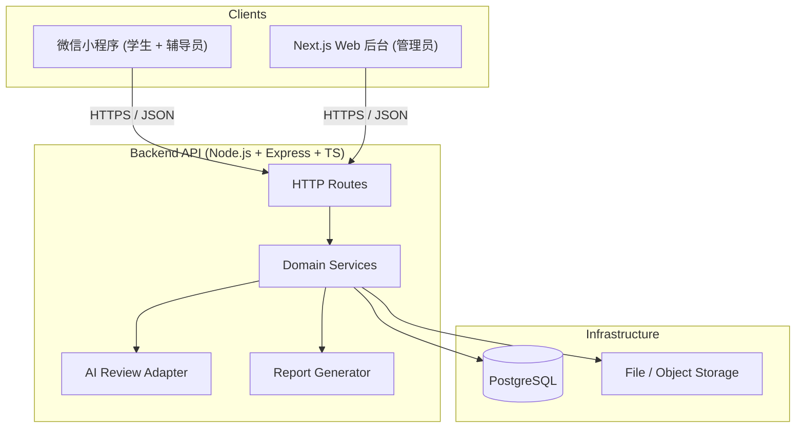
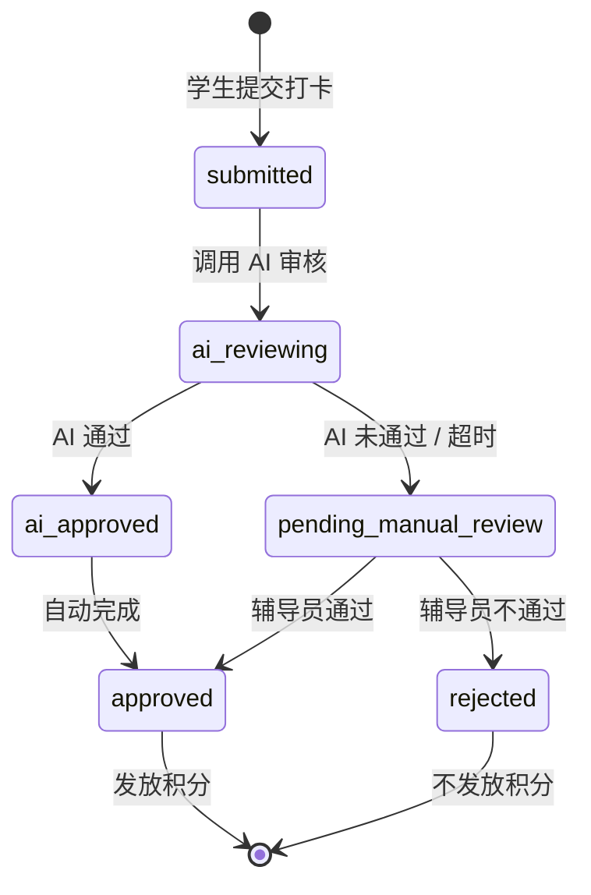
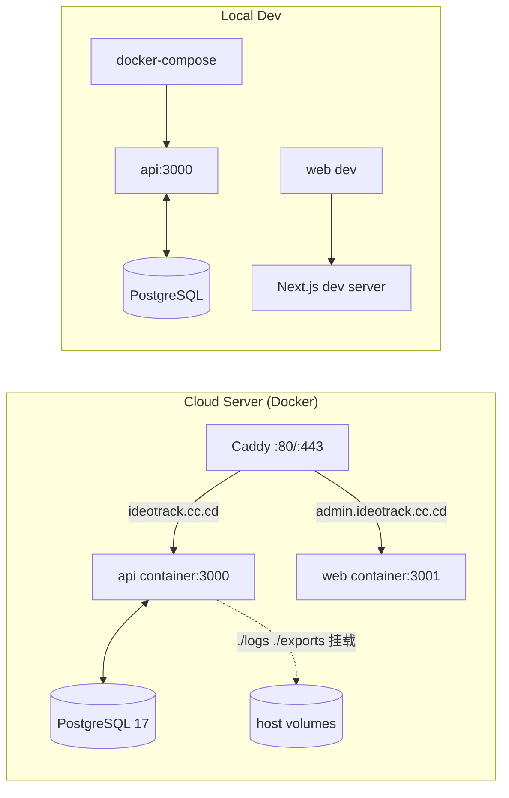

# Architecture Spine — 思政打卡 App

## Design Paradigm

**分层 API-客户端架构（Layered API-Client）。**

- 客户端（微信小程序 + Next.js Web 后台）只通过 HTTPS 调用后端 REST API，不直接访问数据库。
- 后端 API（Node.js + Express + TypeScript）承载业务逻辑、权限控制、AI 审核编排、报表生成。
- PostgreSQL 承载持久化；文件存储（导出报告）在 V1 使用后端本地临时文件或 S3 兼容对象存储，由后端统一管理。



## Invariants & Rules

### AD-1 — Mobile client is a thin client

- **Binds:** All clients (miniprogram + web), all API consumers
- **Prevents:** Business logic leaking into the app, inconsistent validation across platforms
- **Rule:** The client apps（微信小程序与 Next.js Web 后台）perform no business-rule decisions beyond client-side UX validation (e.g., required fields, max length). All state mutations run through the backend API.

### AD-2 — PostgreSQL hosts persistence; files are handled by the API

- **Binds:** Database schema, file storage, deployment
- **Prevents:** Splitting data between self-hosted and managed services, backup drift
- **Rule:** PostgreSQL database is the single source of persistence. File storage for exported reports is handled by the API layer (local temporary files or S3-compatible object storage). The API connects to PostgreSQL via the official `pg` driver; clients never access the database directly.

### AD-3 — LLM provider is abstracted and swappable [ADOPTED]

- **Binds:** AI review service
- **Prevents:** Vendor lock-in to DeepSeek or any single provider
- **Rule:** All LLM calls go through an `LLMProvider` interface/adapter. V1 ships with a DeepSeek adapter, but no other module may import DeepSeek-specific SDK types. Switching providers requires changing only the adapter and config.

### AD-4 — Authentication uses JWT issued by the API

- **Binds:** Auth flow, route protection, mobile storage
- **Prevents:** Session state on server, scaling bottlenecks, ambiguous ownership
- **Rule:** The API issues signed JWTs on login. The mobile app stores the token in secure storage and sends it in the `Authorization: Bearer <token>` header. Tokens carry `userId`, `role`, and `exp` only; claims are authoritative and immutable by the client.

### AD-5 — Role-based access control is enforced at the API layer

- **Binds:** All routes, services, queries
- **Prevents:** Students accessing counselor data, counselors crossing class boundaries
- **Rule:** Every request is validated against the user's role and scoped data ownership (`student` sees own data, `counselor` sees assigned classes, `admin` sees all). Scoping is applied in the service/repository layer, not just route guards.

### AD-6 — AI review is synchronous-with-timeout

- **Binds:** Check-in flow, LLM adapter
- **Prevents:** Indefinite blocking, orphaned check-ins, user confusion
- **Rule:** Reflections are submitted to the LLM adapter synchronously with a 3-second timeout. If the adapter fails or times out, the system marks the reflection for manual counselor review and still records the check-in as "pending review" rather than failing the request.

### AD-7 — Reports are generated server-side and returned via time-limited links

- **Binds:** Report export feature, file lifecycle
- **Prevents:** Mobile generating large PDFs/Excel, inconsistent templates, stale data
- **Rule:** PDF and Excel reports are generated in the API using templates/libraries, stored as temporary files (or in an S3-compatible bucket), and a time-limited download URL/token is returned to the client. Exported files expire after 24 hours.

### AD-8 — Single-tenant, single-school deployment

- **Binds:** Data model, deployment topology
- **Prevents:** Multi-tenant schema complexity, cross-school data leaks
- **Rule:** V1 runs as a single tenant. All data assumes one school organization. Multi-school support is deferred to V2.

### AD-9 — Docker is the deployment unit

- **Binds:** CI/CD, server deployment, local development
- **Prevents:** "Works on my machine", inconsistent runtime environments
- **Rule:** The backend API and any background workers run in Docker containers. Local development uses `docker-compose` with a PostgreSQL service. Production deploys the same image to a cloud server with environment-specific config.

### AD-10 — Domain boundaries mirror PRD feature groups

- **Binds:** Source tree, service boundaries
- **Prevents:** Cross-domain imports, monolithic god modules
- **Rule:** Backend code is organized by domain: `auth`, `users`, `tasks`, `checkins`, `reviews`, `points`, `reports`, `quotes`. A service in one domain may call another only through explicit public methods, not by reaching into repositories.

### AD-11 — Check-in lifecycle state machine is canonical

- **Binds:** `checkins`, `reviews`, `points`, mobile check-in UX
- **Prevents:** Divergent state machines, points awarded at wrong moments, incompatible status values
- **Rule:** A `CheckIn` has exactly these states: `submitted` → `ai_reviewing` → (`ai_approved` | `pending_manual_review`) → (`approved` | `rejected`). Transitions are owned by the `checkins` domain; the `reviews` domain may request a transition only through `CheckIn` aggregate methods. Points are awarded only when `status` becomes `approved`.



### AD-12 — Reflection is a child entity of the CheckIn aggregate

- **Binds:** `checkins`, `reviews`, database schema, API contract
- **Prevents:** Two teams placing reflection in different aggregates, incompatible endpoints and permission models
- **Rule:** `Reflection` is stored in its own table with a required `check_in_id` foreign key, but it is a child entity of the `CheckIn` aggregate. The `checkins` domain owns creation and read; the `reviews` domain updates only review-related status fields through `CheckIn` aggregate public methods.

### AD-13 — Point records are created atomically by the triggering domain

- **Binds:** `checkins`, `points`, transactions
- **Prevents:** Points awarded asynchronously or by multiple owners, inconsistent leaderboard data
- **Rule:** The `points` domain exposes an idempotent `awardPoints({ userId, reason, referenceId, amount })` operation. The `checkins` domain invokes it within the same unit of work when a check-in transitions to `approved`. Point revocation, if needed, is handled by `points` at the request of `checkins`.

### AD-14 — User roles and class scope are owned by the users domain

- **Binds:** `auth`, `users`, RBAC queries
- **Prevents:** Auth and users domains diverging on role/scope representation, broken counselor class-scoping
- **Rule:** The `users` domain is the system of record for `role`, `class_id`, `college_id`, and counselor-to-class assignments. The `auth` domain reads this data at login to issue JWT claims. RBAC queries always join/filter through `users` tables, never duplicate role/scope state elsewhere.

### AD-15 — IDs use UUID via PostgreSQL gen_random_uuid()

- **Binds:** All tables, API contracts, pagination/ordering
- **Prevents:** Mixing UUID v4/v7 or sequential IDs, incompatible ordering assumptions
- **Rule:** All primary keys are UUID v4 generated by PostgreSQL `gen_random_uuid()`（`pgcrypto` 扩展，迁移脚本显式启用）。No table uses auto-increment primary keys. API consumers must not assume sortable IDs; ordering uses explicit `created_at` or `date` columns.
- **[历史]** V1 早期基于 Supabase，2026-06-23 后端迁至自托管 PostgreSQL（见 front-matter changelog），ID 生成方式从 Supabase 默认 UUID 改为 `gen_random_uuid()`，行为等价。

### AD-16 — Leaderboard is computed on demand

- **Binds:** `points`, reporting, API response shape
- **Prevents:** Stale pre-materialized ranks vs slow on-demand queries diverging; hidden table ownership
- **Rule:** The class leaderboard is computed on demand by aggregating approved check-ins (or point records) grouped by class over the selected time range. There is no persistent `leaderboard_entries` table in V1. Results are cached for up to 5 minutes.

### AD-17 — Clients are deployed per-role (multi-end)

- **Binds:** All clients, login flows, notification delivery
- **Prevents:** Forcing high-frequency student check-in scenarios onto a heavyweight App install; letting the WeChat file sandbox compromise export features; forcing admin management scenarios onto a mobile App
- **Rule:** Clients are deployed per role:
  - **Student client** → WeChat Mini Program (native development, located at `miniprogram/`)
  - **Counselor client** → WeChat Mini Program (native development, located at `miniprogram/`, role-routed into counselor views)
  - **Admin client** → Next.js Web Dashboard (`web/`) — V1（提前自原 V2 计划，见 sprint-change-proposal-2026-06-24-v2）

  Deployment boundaries follow these constraints:
  - Students log in via WeChat login (`wx.login` + first-time student-ID binding); counselors log in via staff-ID + password inside the Mini Program; admins via account + password inside the Next.js Web Dashboard. All three flows reuse the existing JWT system (AD-4).
  - Counselor exports (FR-24) are generated on the backend and returned as temporary download links; the user copies the link to a browser to download, bypassing the WeChat Mini Program file sandbox.
  - Admin exports (FR-28) run natively in the Web Dashboard (browser download, no sandbox).
  - Student/counselor notifications use WeChat subscribe messages; admin notifications use Web in-app notifications.
  - The backend API is fully platform-agnostic; all ends share the same REST interface.
  - The Expo App (`mobile/`) admin implementation is **deprecated** and retained as reference only.

### AD-18 — Operations data is exposed read-only to the API container

- **Binds:** backup strategy, log persistence, ops API surface
- **Prevents:** Silent data loss (no backups); the API container being unable to read operational state; backups dying with the API process
- **[实现状态：部分实现]** 截至 2026-06-25：
  - ✅ 生产日志已落地：`./logs` 卷挂载到 api 容器 `/app/logs`（`docker-compose.yml`）。
  - ❌ **未实现**：host cron 备份（`pg_dump` → `/opt/IdeoTrack/backups`）尚未部署；`docker-compose.yml` 中无 `./backups:/app/backups:ro` 只读挂载。
  - ❌ **未实现**：`api/src/domains/ops` 域与 `/api/ops` 路由不存在。
  - ❌ **占位**：`web/app/(admin)/operations/page.tsx` 存在，但渲染的是 `@/lib/data` 的静态 mock 数据，未接后端。
- **Target Rule（待落地）:**
  - Database backups run via **host cron** (`pg_dump`), not in-process — they survive API crashes.
  - Backups are written to `/opt/IdeoTrack/backups` and mounted **read-only** (`./backups:/app/backups:ro`) into the api container.
  - A new **ops domain** (`api/src/domains/ops`) exposes admin-only read endpoints (`health` / `backups` / `system` / `logs`) under `/api/ops`.
  - No host root info is exposed; only container-scoped memory/disk are reported.

### AD-19 — Admin Web dashboard is a Next.js app sharing the REST API

- **Binds:** admin client tech stack, auth transport, deployment
- **Prevents:** divergent admin implementations; mobile/web feature drift; rebuild of backend for web
- **Rule:**
  - Admin dashboard is Next.js (App Router) + TypeScript at `web/`.
  - It consumes the existing REST API (`/api/*`) with the same JWT (AD-4); token stored in httpOnly cookie (preferred) or localStorage.
  - No backend-for-frontend duplication; the Next.js app is a pure client to the API.
  - CORS on the API whitelists the Web origin via `CLIENT_URL`.
  - Deployment: Caddy reverse-proxies the web origin (or Vercel); same server or separate.

### AD-20 — 地理围栏由后端集中配置与校验

- **Binds:** checkins 领域、管理员配置（Web）、签到流程
- **Prevents:** 围栏规则散落客户端被绕过；多端判定不一致；位置作弊
- **Rule:**
  - 围栏配置（`center_lat`/`center_lng` + `radius_meters` + 作用域 `scope`）由管理员在 Web 后台集中维护，存于 `geofences` 表。仅管理员可配置；辅导员只读。
  - 签到时 `checkins.createOrUpdateCheckIn` 在落库前做 Haversine 点-圆距离判定：命中任一适用围栏（按 `scope_type` 匹配 school/building/class，复用 AD-14 范围）即通过；全部未命中拒绝，返回错误码 `CHECKIN_OUTSIDE_GEOFENCE`。
  - 小程序仅负责 `wx.getLocation`（gcj02）获取与错误态展示，不做围栏判定（AD-1）。
  - 围栏坐标统一使用 gcj02 体系，与 `wx.getLocation` 返回一致。
  - 在 Web 配置 UI 就绪前，可用迁移脚本/种子 SQL 配置初始围栏，不阻塞后端校验开发。

### AD-21 — 任务内容源头单一（管理员建池 + 辅导员派发）

- **Binds:** tasks 领域、管理员/辅导员权限、任务发布流程
- **Prevents:** 思政内容碎片化与质量参差；重复创建；缺乏审核；全校统计来源混杂
- **Rule:**
  - 管理员是任务内容的唯一源头：创建/编辑/下架思政任务（标题、正文、思考题、链接），可直接发布到 school/college/class，或发布到任务池供辅导员派发。
  - 辅导员不能自创任务内容，只能派发：从任务池选择一个源任务（`source_task_id`），指定本班（`scope` 固定 class，校验 `counselor_classes`，AD-14），设定截止时间，生成一个派发实例（tasks 行，`source_task_id` 指向源）。
  - 派发实例的标题/正文/思考题/链接从源任务拷贝（快照），不可被辅导员修改；辅导员只能修改 `target_class_id` / `deadline_at` / 下架。
  - `tasks` 表新增 `source_task_id`（nullable UUID，指向源任务；管理员直接创建的为 NULL）。
  - 学生端逻辑不变：学生看到的始终是 tasks 行（无论是否派生）。

### AD-22 — 任务内容采用 P1 结构化纯文本（正文 + 思考题 + 外部链接 + 视频 URL）

- **Binds:** tasks 领域、任务内容形态、心得审核
- **Prevents:** 纯文本任务缺乏思考引导导致套话敷衍；过早引入自托管富媒体带来的存储与审核成本
- **Rule:**
  - V1 任务内容由四部分组成：正文（`content`，纯文本）+ 思考题（`guiding_questions`，JSONB 数组，可选）+ 外部链接（`source_url`，可选）+ 视频 URL（`video_url`，可选，指向外部托管）。
  - 存储为 `tasks` 表的四个字段；`guiding_questions` 为 JSONB 数组（如 `["问题1","问题2"]`）。
  - 视频 URL 指向外部托管（如学习强国/学校官网），V1 不支持自托管视频上传；需在微信小程序后台配置视频域名白名单。
  - 学生心得（reflection）仍为纯文本 10–500 字（不变）；思考题为可选，不强制要求逐题作答。
  - 自托管富媒体（图片/视频/PDF 上传 + 富文本编辑器）推迟到 V2，依赖通用文件存储基建（当前 AD-7 仅为导出报告设计，V2 需扩展为通用媒体存储并新增 AD）。
  - AI 初审（Story 5.1）可利用 `guiding_questions` 提升相关性检测（V1 可选，不强制）。

## Consistency Conventions

| Concern | Convention |
| --- | --- |
| Naming (files, tables, functions) | `camelCase` for TS/JS identifiers; `snake_case` for PostgreSQL columns; table names plural nouns (`users`, `check_ins`). |
| IDs | UUID (v4) via PostgreSQL `gen_random_uuid()` (`pgcrypto`) for all primary keys; no auto-increment IDs. Self-hosted PostgreSQL since 2026-06-23 (Supabase no longer used). |
| Dates/Times | Stored as UTC `timestamptz`; API returns ISO 8601; clients format to local timezone. |
| API responses | Standard envelope: `{ success: boolean, data?: T, error?: { code: string, message: string } }`. |
| Errors | HTTP status codes match semantics; `code` is machine-readable (e.g., `CHECKIN_ALREADY_EXISTS`). |
| Auth header | `Authorization: Bearer <jwt>` on every protected route. |
| Logging | Structured JSON logs; no sensitive data (passwords, location precision) logged. |
| Environment config | All secrets and provider URLs live in environment variables; no hardcoded keys. |

## Stack

| Name | Version / Note |
| --- | --- |
| 微信小程序原生 (WeChat Mini Program) | base library 3.x — student + counselor client |
| Next.js (App Router) | V1 admin client (`web/`, AD-19); TypeScript; consumes the REST API |
| Node.js | 24 LTS |
| Express | 5.2.x |
| TypeScript | 6.0.x |
| PostgreSQL | 17 — self-hosted via Docker (`postgres:17-alpine`) since 2026-06-23 |
| pg (node-postgres) | 8.15.x |
| LLM API | Via `LLMProvider` adapter; DeepSeek model ID configured externally |
| JSON Web Tokens | `jsonwebtoken` 9.0.3 |
| PDF/Excel generation | `pdfkit` 0.19+ / `exceljs` 4.4+ / `puppeteer` 25+ |
| Caddy | 2.x — reverse proxy for api (`ideotrack.cc.cd`) and web (`admin.ideotrack.cc.cd`) origins |
| Docker Engine | 29+ |
| Docker Compose plugin | 2.40+ |

> [DEPRECATED] React Native + Expo (`mobile/`) was the original admin client. It is retained as reference only; the V1 admin client is the Next.js web app at `web/` (AD-17 / AD-19). Expo SDK 56 / React Navigation 7.x are no longer part of the active stack.

## Structural Seed

```text
ideo-track/
├── mobile/                         # [DEPRECATED] React Native + Expo — former admin client, reference only (AD-17)
├── web/                            # Next.js (App Router) — admin client, V1 (AD-17, AD-19)
│   ├── app/
│   │   ├── (admin)/                # admin route group (layout + guarded pages)
│   │   │   ├── tasks/              # task management (create / [id] / edit)
│   │   │   ├── quotes/             # quote library
│   │   │   ├── organizations/      # college / class structure
│   │   │   ├── users/              # user management
│   │   │   ├── reports/            # school-wide reports
│   │   │   └── operations/         # ops view (currently mock data, see AD-18)
│   │   ├── login/                  # account + password login
│   │   └── change-password/
│   ├── components/
│   ├── lib/
│   ├── Dockerfile                  # Dockerfile.web at repo root builds this image
│   └── package.json
├── miniprogram/                    # WeChat Mini Program — student + counselor client (AD-17)
│   ├── pages/
│   │   ├── auth/                   # role-aware login: WeChat login (student) / staff-ID password (counselor)
│   │   ├── home/                   # home (quote + task list)
│   │   ├── task/                   # task detail + check-in entry
│   │   ├── checkin/                # location check-in + reflection submit
│   │   ├── reflection/             # reflection edit
│   │   ├── calendar/               # personal check-in calendar
│   │   ├── profile/                # personal center
│   │   ├── leaderboard/            # class leaderboard (V2)
│   │   ├── notifications/          # notification center
│   │   ├── counselor/              # counselor views (role-routed)
│   │   │   ├── dashboard/          # class overview
│   │   │   ├── classes/            # class list + detail
│   │   │   ├── review/             # reflection review
│   │   │   ├── tasks/              # task dispatch (AD-21)
│   │   │   ├── export/             # data export via temporary link
│   │   │   └── stats/
│   │   └── tab/                    # role-specific tab bar
│   ├── components/
│   ├── services/                   # wx.request wrapper
│   ├── utils/                      # token storage (wx.setStorageSync), date format
│   ├── app.json                    # page registration + tabBar config (role-specific)
│   ├── app.ts                      # entry
│   └── project.config.json         # WeChat DevTools config
├── api/                            # Node.js + Express + TypeScript
│   ├── src/
│   │   ├── config/
│   │   ├── domains/
│   │   │   ├── auth/
│   │   │   ├── users/
│   │   │   ├── tasks/
│   │   │   ├── checkins/
│   │   │   ├── reviews/
│   │   │   ├── points/
│   │   │   ├── reports/
│   │   │   ├── quotes/
│   │   │   ├── geofences/          # geofence config + validation (AD-20)
│   │   │   └── counselor/
│   │   ├── adapters/
│   │   │   └── llm/
│   │   │       ├── provider.ts
│   │   │       └── deepseek.adapter.ts
│   │   ├── middleware/
│   │   ├── lib/
│   │   └── index.ts
│   ├── Dockerfile
│   └── package.json
├── docker-compose.yml              # postgres + api + web (+ optional caddy profile)
├── Dockerfile.web                  # builds the web/ admin image
├── Caddyfile                       # reverse proxy: ideotrack.cc.cd→api, admin.ideotrack.cc.cd→web
└── docs/
```

## Core Entity Relationships

```mermaid
erDiagram
    SCHOOL ||--o{ COLLEGE : has
    COLLEGE ||--o{ CLASS : has
    CLASS ||--o{ USER : contains
    USER ||--o| STUDENT_PROFILE : "if role=student"
    USER ||--o| COUNSELOR_PROFILE : "if role=counselor"
    USER ||--o| ADMIN_PROFILE : "if role=admin"
    CLASS ||--o{ TASK : assigned_to
    TASK ||--o{ CHECK_IN : generates
    USER ||--o{ CHECK_IN : submits
    CHECK_IN ||--o{ REFLECTION : has
    REFLECTION ||--o{ AI_REVIEW : reviewed_by
    REFLECTION ||--o{ MANUAL_REVIEW : reviewed_by
    USER ||--o{ POINT_RECORD : earns
    GEOFENCE ||--o{ CHECK_IN : validates
```

> [V2] 班级排行榜（`LEADERBOARD_ENTRY`）无持久化表，按需聚合（AD-16），故未列入 V1 ER 图。`GEOFENCE` 由 AD-20 引入。

## Capability → Architecture Map

| Capability / Area | Lives in | Governed by |
| --- | --- | --- |
| 学生登录/角色鉴权 | `api/src/domains/auth` + `miniprogram/services` | AD-4, AD-5, AD-17 |
| 辅导员登录/角色鉴权 | `api/src/domains/auth` + `miniprogram/services` | AD-4, AD-5, AD-17 |
| 管理员登录/角色鉴权 | `api/src/domains/auth` + `web/` | AD-4, AD-5, AD-17, AD-19 |
| 任务发布与展示 | `api/src/domains/tasks` + `miniprogram/pages` / `web/`(管理) | AD-1, AD-10, AD-17, AD-21, AD-22 |
| 定位签到与地理围栏校验 | `api/src/domains/checkins` + `api/src/domains/geofences` + `miniprogram/pages` + `web/`(围栏配置) | AD-1, AD-5, AD-14, AD-20 |
| AI 初审 | `api/src/adapters/llm` + `api/src/domains/reviews` | AD-3, AD-6 |
| 辅导员人工复核 | `api/src/domains/reviews` + `miniprogram/pages/counselor` | AD-5, AD-10, AD-17 |
| 辅导员数据看板 | `api/src/domains/counselor` + `miniprogram/pages/counselor` | AD-5, AD-10, AD-17 |
| 积分与等级 | `api/src/domains/points` | AD-1, AD-10, AD-13 |
| 班级排行榜 | `api/src/domains/points` (on-demand aggregate, V2) | AD-5, AD-10, AD-16 |
| 全校统计报表 | `api/src/domains/reports` | AD-2, AD-7, AD-10 |
| 文件存储（报告） | `api/src/lib/storage`（本地临时文件 / S3 兼容对象存储） | AD-2, AD-7 |
| 每日名言 | `api/src/domains/quotes` | AD-1, AD-10 |
| 运维仪表盘 | `web/app/(admin)/operations`（mock）+ 待实现 `api/src/domains/ops` | AD-18（计划中，见下） |

## Deployment & Environments



- **Local**: `docker-compose up` 运行 `postgres` + `api`（+ 可选 `web`）；`api/` 与 `web/` 各自支持 `npm run dev` 热重载。存储用本地临时文件。
- **Production**: 同一份 Docker 镜像部署到云服务器。`docker-compose.yml` 编排 `postgres` + `api` + `web`，`caddy` 服务（`with-caddy` profile）反代两个域名：`ideotrack.cc.cd` → `api:3000`，`admin.ideotrack.cc.cd` → `web:3001`。`./logs` 与 `./exports` 卷挂载到 api 容器持久化。
- **CI/CD**: GitHub Actions（`.github/workflows/deploy.yml`、`seed.yml`）构建并推送 Docker 镜像；服务器拉取最新镜像并重启。
- **[计划中，未实现]** AD-18 描述的 host cron 备份（`pg_dump` → `/opt/IdeoTrack/backups`）与 `./backups:/app/backups:ro` 只读挂载尚未在 `docker-compose.yml` 中落地。

## Deferred

| Item | Reason it can wait |
| --- | --- |
| 多学校/SaaS 化 | V1 单学校部署已满足实习需求；多租户需要独立的 schema 和权限重构。 |
| 高级 AI 分析（情感分析、学习效果评估） | PRD 已列为 V2；当前 AI 模块只暴露统一接口，未来可扩展。 |
| 第三方登录/学校 SSO | PRD 已列为 V2；JWT 体系已预留 `provider` 字段。 |
| 离线同步 | V1 假设基本网络可用；本地状态可用 AsyncStorage 缓存，非架构核心。 |
| 消息推送服务（FCM/APNs） | 辅导员提醒可用应用内通知先满足；推送服务可后续接入。 |
| 微服务拆分 | 单体后端已足够；按 domain 组织代码便于未来拆分。 |

