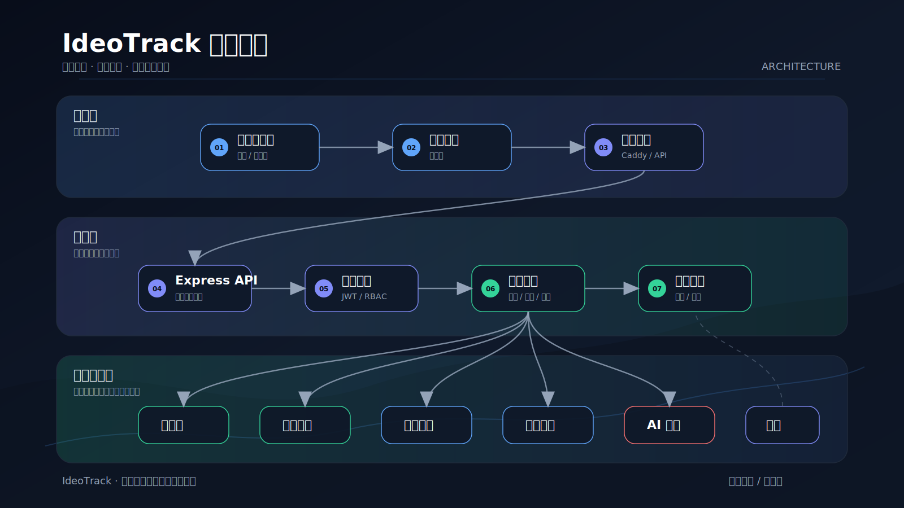
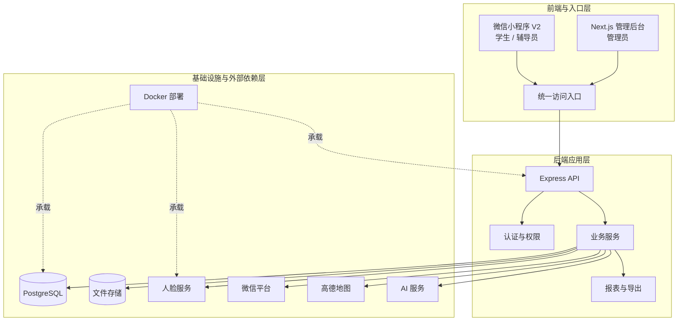

# IdeoTrack 系统架构图

下图基于当前仓库源码和路演 PPT 视觉风格整理，采用上下分层结构：最上层是前端，中间是后端，底层是基础设施。节点保持简洁，适合直接放进演示文稿。

```mermaid
flowchart TB
  subgraph L1["前端与入口层"]
    MP["微信小程序 V2<br/>学生 / 辅导员"]
    WEB["Next.js 管理后台<br/>管理员"]
    CADDY["统一访问入口"]
  end

  subgraph L2["后端应用层"]
    API["Express API"]
    AUTH["认证与权限"]
    SERVICES["业务服务"]
    REPORTS["报表与导出"]
  end

  subgraph L3["基础设施与外部依赖层"]
    PG[("PostgreSQL")]
    FILES[("文件存储")]
    FACE["人脸服务"]
    WECHAT["微信平台"]
    AMAP["高德地图"]
    LLM["AI 服务"]
    DOCKER["Docker 部署"]
  end

  MP --> CADDY
  WEB --> CADDY
  CADDY --> API

  API --> AUTH
  API --> SERVICES
  SERVICES --> REPORTS
  SERVICES --> PG
  SERVICES --> FILES
  SERVICES --> FACE
  SERVICES --> WECHAT
  SERVICES --> AMAP
  SERVICES --> LLM
  DOCKER -.承载.-> API
  DOCKER -.承载.-> PG
  DOCKER -.承载.-> FACE
```
